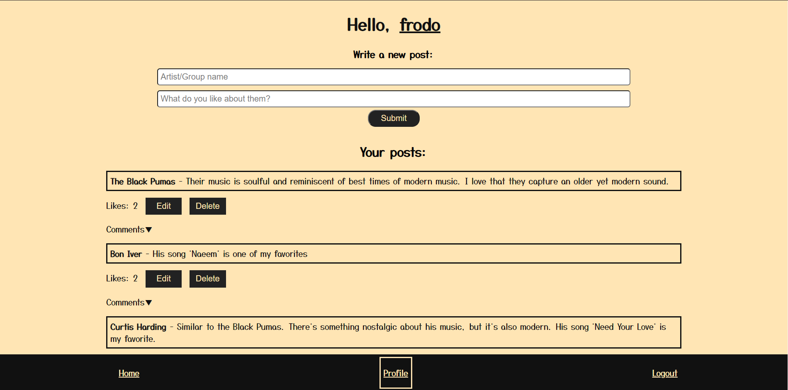
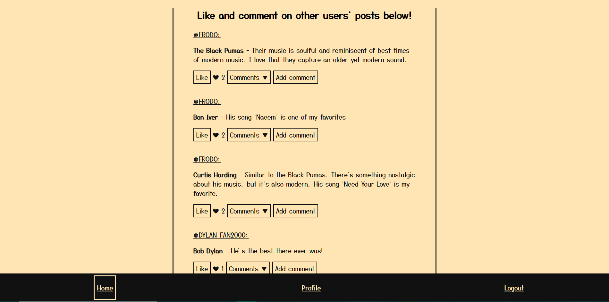

# Favorite Musicians app

This was one of my full stack assignments while attending my coding boot camp. It features user authentication where the username creates a profile with a username and password. The user can add the name of an artist/band/musician that they like, and then add a short description about that artist. They have the ability to edit or delete that post. On the home page, they can see users' other posts, like a post, as well as add a comment specific to that post.

### Technologies used

- Front end:
    - React
    - JavaScript
    - HTML
    - CSS
- Back end:
    - Node.js
    - Express.js
    - MongoDB
    - Mongoose
    - JWT & express-jwt

### Views

Profile:

Home:

